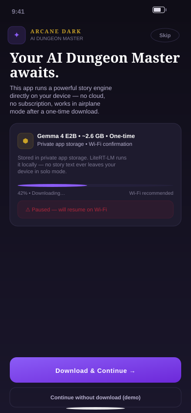
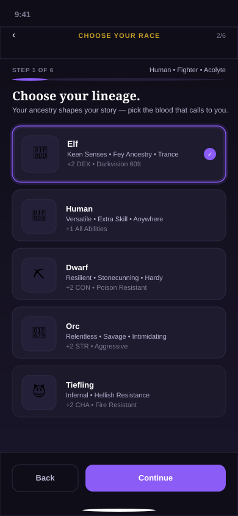
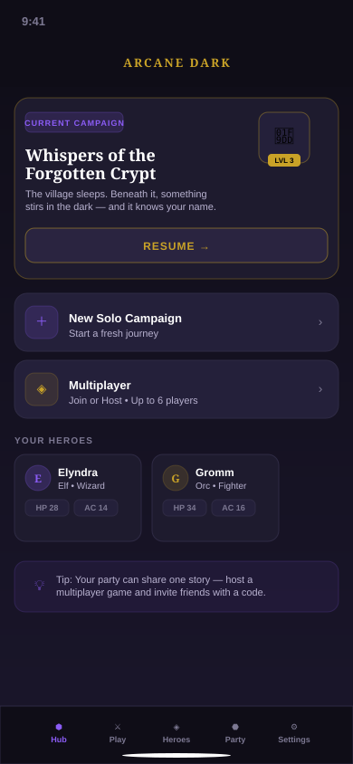
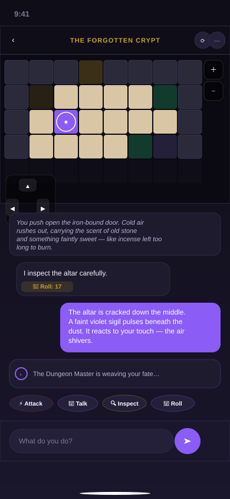
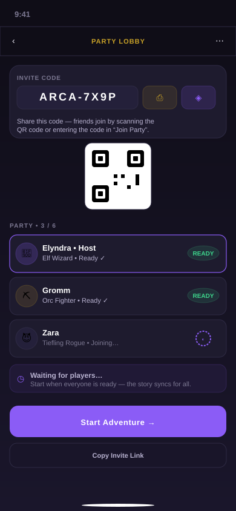

# Arcane Dark

<p align="center">
  <a href="https://chartmann1590.github.io/arcane-dark/"></a>
  <a href="https://chartmann1590.github.io/arcane-dark/privacy.html"></a>
  <a href="https://github.com/chartmann1590/arcane-dark"></a>
</p>

<p align="center">
  <strong>A Dungeons & Dragons–style adventure with an AI Dungeon Master that lives entirely on your phone.</strong><br/>
  Create a hero, step into a torch-lit dungeon, and let an on-device AI weave your story — solo, offline, and completely private.<br/>
  Or gather up to five friends and share one adventure together.
</p>

<p align="center">
  <a href="https://chartmann1590.github.io/arcane-dark/"><strong>🌐 Visit the website → chartmann1590.github.io/arcane-dark</strong></a> •
  <a href="https://chartmann1590.github.io/arcane-dark/privacy.html">Privacy Policy</a> •
  <a href="#screenshots">Screenshots</a> •
  <a href="#for-developers">For developers</a>
</p>

---

### ✨ Website

**Live at [https://chartmann1590.github.io/arcane-dark/](https://chartmann1590.github.io/arcane-dark/)** — the beautiful project site with features, screenshots, and privacy policy. It’s automatically deployed from `docs/` via GitHub Pages.

- **Site:** [`docs/index.html`](docs/index.html) + [`docs/privacy.html`](docs/privacy.html)
- **Privacy on the web:** [chartmann1590.github.io/arcane-dark/privacy.html](https://chartmann1590.github.io/arcane-dark/privacy.html) (mirrors [`PRIVACY.md`](PRIVACY.md))

---

### Screenshots

<p align="center"><em>High-fidelity mockups from the app’s dark-fantasy design system (<code>lib/app/theme.dart</code> — violet #8B5CF6, aged gold #C9A227, <code>Playfair Display</code> + <code>Manrope</code>). Real device captures will replace these after the Play Store listing is live.</em></p>

<table>
  <tr>
    <td align="center" width="20%"><a href="https://chartmann1590.github.io/arcane-dark/screenshots/01-onboarding.svg"></a><br/><sub><strong>01 · Onboarding</strong><br/>One-time 2.6GB Gemma download</sub></td>
    <td align="center" width="20%"><a href="https://chartmann1590.github.io/arcane-dark/screenshots/02-character-creation.svg"></a><br/><sub><strong>02 · Character Creator</strong><br/>Race, class, abilities, portrait</sub></td>
    <td align="center" width="20%"><a href="https://chartmann1590.github.io/arcane-dark/screenshots/03-campaign-hub.svg"></a><br/><sub><strong>03 · Campaign Hub</strong><br/>Resume, heroes, multiplayer</sub></td>
    <td align="center" width="20%"><a href="https://chartmann1590.github.io/arcane-dark/screenshots/04-gameplay.svg"></a><br/><sub><strong>04 · Gameplay</strong><br/>Dungeon + AI narration</sub></td>
    <td align="center" width="20%"><a href="https://chartmann1590.github.io/arcane-dark/screenshots/05-multiplayer.svg"></a><br/><sub><strong>05 · Multiplayer</strong><br/>QR invite, up to 6 players</sub></td>
  </tr>
</table>

> **Tip:** Click any image to view it full-size on the website. All screenshots live in [`docs/screenshots/`](docs/screenshots/).

---

## What makes it different

- **Your AI Dungeon Master never leaves your phone.** Arcane Dark runs Google's Gemma model directly on-device. In solo play, no story text, no character details, and no choices you make are ever sent anywhere — not even to us.
- **Play anywhere, no signal needed.** After a one-time download, solo mode works fully offline — on a plane, underground, camping, wherever.
- **A real character creator.** Pick a race, a class, a background, allocate ability scores the way tabletop players expect, and build a look for your hero with a live portrait editor.
- **Procedurally generated dungeons.** Every playthrough drops you into a freshly generated map — no two runs alike.
- **Bring your friends.** Host or join a party of up to six and adventure together in a shared session.

## Get it

Arcane Dark is built for Android (iOS coming later). Store links will be added here once the app is published.

Visit the website for the full experience: **[chartmann1590.github.io/arcane-dark](https://chartmann1590.github.io/arcane-dark/)**

## Privacy

Solo play never leaves your device. Full details are in [`PRIVACY.md`](PRIVACY.md), inside the app under **Settings → Privacy Policy**, and on the web at **[chartmann1590.github.io/arcane-dark/privacy.html](https://chartmann1590.github.io/arcane-dark/privacy.html)**.

## Support

Found a bug or have a suggestion? Open an issue on this repository.

---

## For developers

This is a Flutter app. The architecture, build phases, and design decisions are documented in [`plan/`](plan/) — start with [`plan/00-overview.md`](plan/00-overview.md).

### Requirements
- Flutter 3.35+, Dart 3.9+
- Android Studio / an Android SDK for building the Android target
- A physical or emulated Android device running API 26+ (the on-device model needs a real device with enough RAM/storage — see `plan/02-on-device-ai-runtime.md`)

### Setup
```bash
flutter pub get
flutter run
```

The AI model (~2.6GB) is not bundled in the app — it downloads on first run from [Hugging Face](https://huggingface.co/litert-community/gemma-4-E2B-it-litert-lm) per `assets/model_manifest.json`.

### Before you ship your own build
- Replace the placeholder AdMob IDs in `lib/services/ad_config.dart`, `android/app/src/main/AndroidManifest.xml`, and `ios/Runner/Info.plist` with your own (they currently point at Google's public test ad units).
- Set up your own Firebase project for multiplayer/Crashlytics/Performance Monitoring (`plan/06-multiplayer-firebase-backend.md`, `plan/08-observability-crashlytics-performance.md`) and drop in your own `google-services.json` / `GoogleService-Info.plist` — these are gitignored and not included here.
- Review `plan/09-testing-polish-launch.md` for the release checklist (signing, obfuscation, store listing).

### Project structure
- `lib/` — the Flutter app (feature-organized: `features/`, `domain/`, `services/`, `providers/`)
- `android/`, `ios/` — native platform projects (the Android side includes a hand-written Kotlin bridge to Google's LiteRT-LM inference engine in `android/app/src/main/kotlin/.../LlmEngine.kt`)
- `plan/` — the full phase-by-phase design and implementation plan this app was built from
- `docs/` — **the GitHub Pages website** (`index.html`, `privacy.html`, `screenshots/`, `assets/`) + `docs/design/` reference mockups
- `docs/design/` — exported reference mockups from the app's design system

### License
No license has been chosen yet for this repository's code. All rights reserved unless a `LICENSE` file says otherwise.
