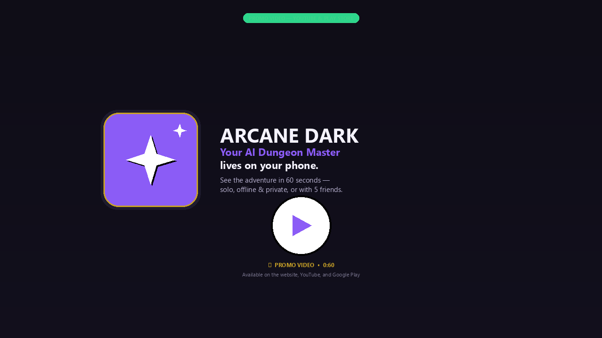
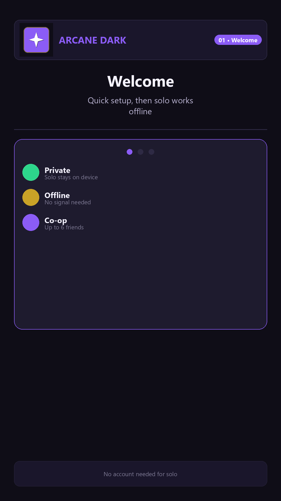
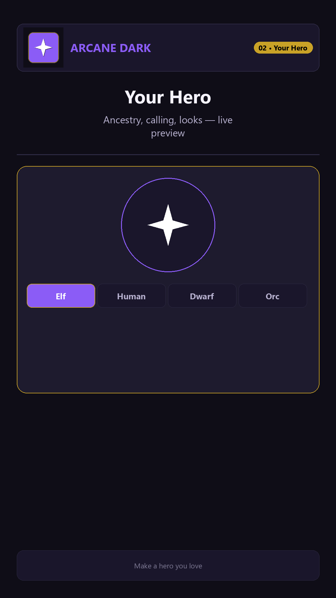
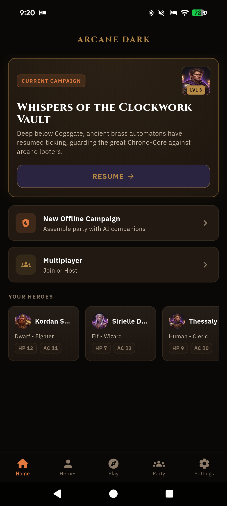
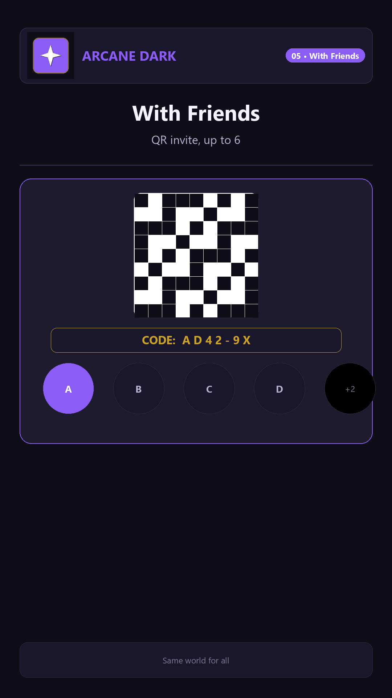
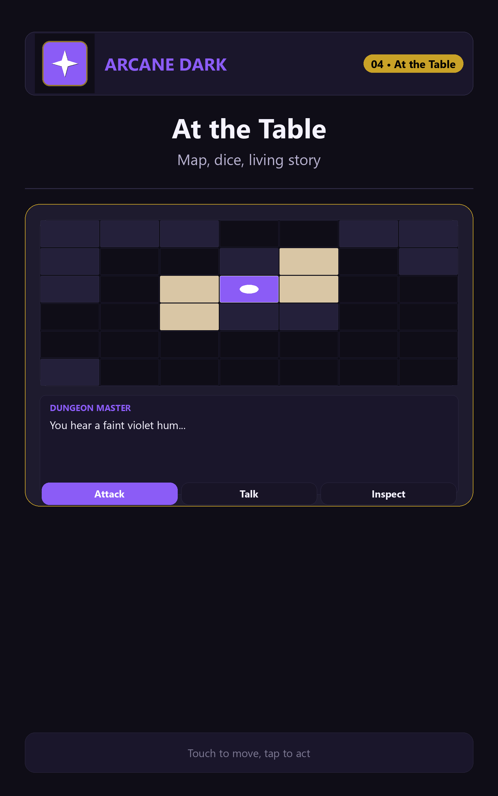
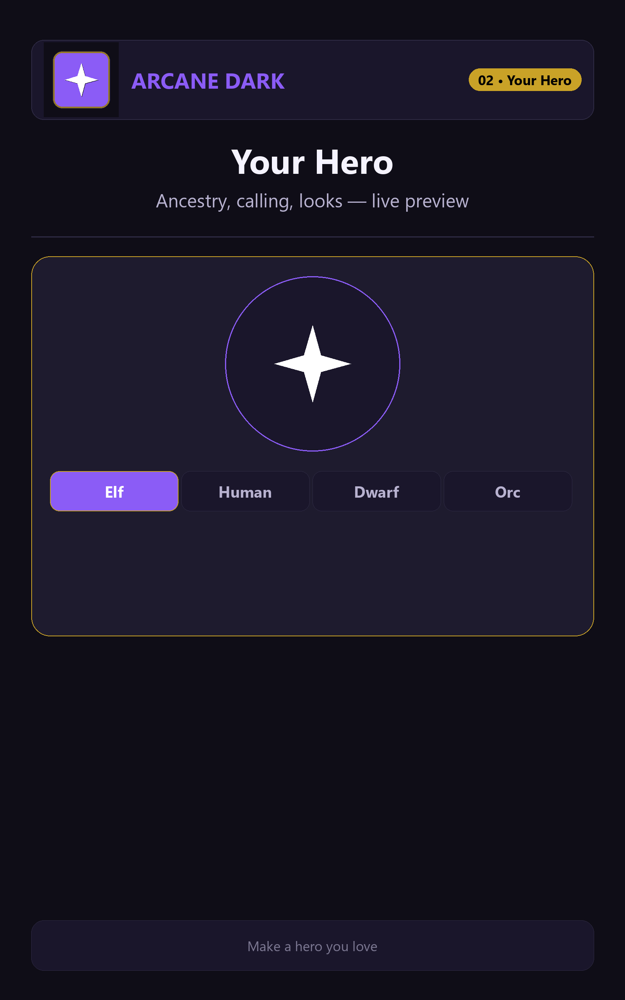

# Arcane Dark

  
  
  
  

  <strong>Your AI Dungeon Master lives on your phone.</strong> 
  A cozy, torch-lit fantasy adventure you can play anywhere — alone under a blanket fort, 
  or with up to 5 friends gathered around one living map. 
  <em>No subscriptions. No waiting. Just say what you do, and watch the story answer.</em>

  <a href="https://play.google.com/store/apps/details?id=com.arcane.dndai.dnd_ai"><strong>📲 Download on Google Play Store</strong></a> •
  <a href="https://chartmann1590.github.io/arcane-dark/">Official Website</a> •
  <a href="https://chartmann1590.github.io/arcane-dark/privacy.html">Privacy</a> •
  <a href="#-peek-inside">Screenshots</a>

> **🚀 Available on Google Play for Android:** [Download Arcane Dark on Google Play](https://play.google.com/store/apps/details?id=com.arcane.dndai.dnd_ai) — iPhone planned for later. Check out the [Official Trailer on YouTube](https://youtu.be/sLaqCrVsjWQ).

---

### ✨ Why players love it

- **A storyteller that's always ready.** No need to find a host or learn rulebooks. If you can describe what you'd do, you can play.
- **Private by design.** Your solo quests stay on your phone. No account needed to play alone.
- **Plays anywhere.** After one quick setup on Wi-Fi, solo adventures work with no signal — perfect for planes, cabins, campouts, or the couch.
- **A hero that's truly yours.** Choose your ancestry, calling, and past, shape your look with a live portrait, give yourself a title and battle-cry — even bring an animal friend.
- **A new dungeon every time.** Winding crypts, sunken citadels, haunted manors, bustling cities, deep forests and cozy taverns — with fog, hidden doors, traps and treasure.
- **Real table magic.** Type in plain words — *“I inspect the altar,” “I try to talk them down,” “Thorin, smash the door!”* — and get narration, open dice rolls, and consequences back.
- **Bring your whole party.** Host or join with a code or QR scan — up to 6 heroes share the same map, story, and laughter.

### 🎮 How a game feels

1. **Make your hero** — who you are, how you fight, what you carry, what you look like, and which little companion trots beside you.
2. **Step into the dark** — wander the map, chat with townsfolk, open doors, dodge traps, follow whispers.
3. **Watch the story answer** — your Dungeon Master narrates line by line, rolls dice where you can see them, remembers your quests, places, and people in your journal, and lets your companions pipe up on their own.

Five minutes or five hours — your adventure waits right where you left it.

---

### 📺 Watch the trailer

  

<em><a href="https://youtu.be/sLaqCrVsjWQ">▶ Watch the 1080p Official Promo Video on YouTube (with sound & narration)</a></em>

### 👀 Peek inside

<em>Real captures from the game today — warm tavern light, living maps, heroes with history. Tap any image to enlarge.</em>

#### Phone

<table>
  <tr>
    <td align="center" width="20%"> <strong>Choose a Legend</strong> Twelve tales to chase</td>
    <td align="center" width="20%"> <strong>Your Hero</strong> Lineage, gifts, story</td>
    <td align="center" width="20%"> <strong>Home</strong> Campaign & heroes</td>
    <td align="center" width="20%"> <strong>At the Table</strong> Map, story, dice</td>
    <td align="center" width="20%"> <strong>Your Party</strong> Heroes ready for anything</td>
  </tr>
</table>

**What you're seeing, left to right:**
- **Choose a Legend** – The Whispering Crypts, Ember of the Wastes, Frostpeak Spire, Sunken Citadel and more. Pick your mood.
- **Your Hero** – Step 1 of 6: lineage shapes your gifts and story. Human, Elf, Dwarf, Halfling, Orc, Tiefling and more.
- **Home** – Whispers of the Clockwork Vault, ready to resume, with Kordan, Sirielle and Thessaly waiting.
- **At the Table** – A real village quest, Beat 3 of 5, with Thessaly, Kordan and Elara on the map, narration, and gentle suggestions like Listen at Doorway.
- **Your Party** – Kordan Steelhand, Sirielle Duskwhisper, Thessaly Vane, Valgar Bloodscale, Lyra Windrunner and friends, with portraits, hearts and armor.

#### Tablets — made for the big table

Arcane Dark glows on 7" and 10" tablets — bigger map, easier reading, perfect for passing around the couch.

<table>
  <tr>
    <td align="center" width="33%"> <strong>7" Tablet — At the Table</strong></td>
    <td align="center" width="33%"> <strong>10" Tablet — At the Table</strong></td>
    <td align="center" width="33%"> <strong>10" Tablet — Your Hero</strong></td>
  </tr>
</table>

> See the trailer and full gallery on the [website](https://chartmann1590.github.io/arcane-dark/#screenshots).

---

### 🗺️ Twelve legends to chase

Pick your mood and wander in. Every tale starts in a warm, lived-in place — a tavern, an outpost, a market — then pulls you somewhere wonderful and strange:

- **The Whispering Crypts** — restless spirits beneath Oakhaven and a king who should have stayed buried
- **Ember of the Wastes** — a dying ember that could rekindle the world, or end it
- **The Frostpeak Spire** — a frozen observatory where time itself has stopped
- **The Sunken Citadel** — black tides, abyssal idols, and something vast below
- **Whispers of the Clockwork Vault** — ticking automatons guarding a heart of brass and time
- **Descent into the Shadow Rift** — a fissure in the earth pouring out living dark
- **The Celestial Forge** — a star-drifted forge where angels have gone rogue
- **Curse of Blood Moon Manor** — bells toll, villagers vanish, the manor waits
- **The Royal Citadel of Valoria** — a banquet, a king, and a dagger in the dark
- **Shadows Over Highgate** — canals, bazaars, cathedrals, and smuggled soul-gems
- **Wrath of the Emerald Canopy** — a weeping Heart-Tree and a forest turning wild
- **Echoes of the Obsidian Geode** — crystal caverns humming with hungry light

Each legend unfolds in beats — investigate, gather, confront, choose — but how you get there is gloriously up to you.

### 🧙 What's inside the adventure

**Create a hero you adore**
- 7 ancestries: Human, Elf, Dwarf, Halfling, Orc, Tiefling, Dragonborn
- 8 callings: Fighter, Wizard, Rogue, Cleric, Ranger, Bard, Barbarian, Paladin
- 8 backgrounds, from Soldier and Sage to Folk Hero and Outlander
- Roll for strengths, take the classic set, or spend points your way
- Appearance studio with live portrait, titles, battle-cries, cloaks, trinkets, and signature weapons
- 8 animal friends, each with its own gift: a Tavern Hound who smells traps, a Spectral Owl who sees farther in the dark, a tiny Pygmy Drake who warms the party, a jiggly Gelatinous Buddy who adores copper coins, and more

**Explore a living world**
- A fresh layout every adventure — rooms, corridors, locked doors, traps, treasure
- Cozy fog that lifts as you wander — you only see what you've bravely explored
- Taverns full of chatter, villages, cities, castles, forests, caves, and wilds beyond
- Torch-lit art, dice sounds, tavern music, and a gentle voice that can read the tale aloud

**Everything you need at the table**
- Open dice — you always see the roll, the bonus, and why things happen, crits and fumbles included
- A journal that remembers your quests, places, and people
- Backpack and gear, up-close battles, one-on-one chats with townsfolk, and companions who wander, joke, and sometimes steal the scene
- Tap-to-move map made for fingers, with pinch, zoom, and a warm isometric glow

**Solo or together — your call**
- **Solo:** just play. No sign-in, story never leaves your device.
- **Together:** sign in free to host or join. Up to 6 heroes share one living map — invite with a code or QR. Only what's needed to keep the table together is shared.

### 🔒 Private, plain and simple

Solo = cozy and private. Your solo heroes and stories stay on your phone.

When you play with friends, a little sync magic keeps everyone on the same map. You can delete any hero or adventure with a tap. The app shows a few ads to stay free — you control ad choices in Settings.

Full story in plain words: **[Privacy Policy](https://chartmann1590.github.io/arcane-dark/privacy.html)** • **[Account & Data Deletion Request](https://chartmann1590.github.io/arcane-dark/delete-account.html)** (also accessible directly within the app under Settings → Account / About).

### 📋 Good to know

| | |
|---|---|
| **Players** | Solo, or up to 6 around one table |
| **Internet** | Needed once for setup, then solo works offline. Playing together needs internet. |
| **Devices** | Android phones + 7" and 10" tablets. iPhone planned later. |
| **Setup** | One quick download on Wi-Fi when you first arrive, then you're free to roam |
| **Cost** | Free to play, kindly supported by ads. No subscription. Optional tip if you love it. |
| **Experience needed** | None — if you can imagine what you'd do, you can play. Brand-new adventurers adored. |

### ❓ Quick answers

**I've never played anything like this. Can I still play?**
Oh yes — that's who it's for. Just say what you'd do in plain words and your Dungeon Master handles the rules, dice, and story. You'll feel clever in minutes.

**Does it work on a plane?**
Yes, for solo. Do the quick setup on Wi-Fi first, then you're good with no signal — clouds optional.

**Do I need an account?**
Only for playing with friends and backing things up. Solo works as a guest, no strings.

**Will my story be sent somewhere?**
No — solo adventures live only on your device unless you choose to play together.

**When can I download it?**
Right now on Google Play! [Download Arcane Dark for Android](https://play.google.com/store/apps/details?id=com.arcane.dndai.dnd_ai) — free to play.

**What do I actually do moment-to-moment?**
Wander, look, talk, sneak, bluff, befriend, barter, flee bravely, pet the tavern hound. Try *“I listen at the door,” “I offer them my bread,” “I run — elegantly.”*

---

### 📲 Get it

**Download free on Google Play for Android:**

  

  👉 <a href="https://play.google.com/store/apps/details?id=com.arcane.dndai.dnd_ai"><strong>https://play.google.com/store/apps/details?id=com.arcane.dndai.dnd_ai</strong></a>

- **Official Website:** [https://chartmann1590.github.io/arcane-dark/](https://chartmann1590.github.io/arcane-dark/)
- **Privacy Policy:** [https://chartmann1590.github.io/arcane-dark/privacy.html](https://chartmann1590.github.io/arcane-dark/privacy.html)
- **YouTube Promo Video:** [https://youtu.be/sLaqCrVsjWQ](https://youtu.be/sLaqCrVsjWQ)

### ☕ Support the tavern

Arcane Dark is hand-made by a solo storyteller. Keeping the candles lit takes time, art, and a truly heroic amount of coffee — if you're having fun, a small tip keeps the dungeons warm and the tavern songs coming.

  

  <a href="https://buymeacoffee.com/charleshartmann"><strong>☕ buymeacoffee.com/charleshartmann</strong></a>

### 💬 Questions or ideas?

Open an issue — we read every single one, usually with tea.

---

<em>© 2026 Arcane Dark • <a href="https://chartmann1590.github.io/arcane-dark/">Website</a> • <a href="https://play.google.com/store/apps/details?id=com.arcane.dndai.dnd_ai">Google Play</a> • <a href="https://chartmann1590.github.io/arcane-dark/privacy.html">Privacy Policy</a> • <a href="https://buymeacoffee.com/charleshartmann">☕ Buy me a coffee</a></em>

